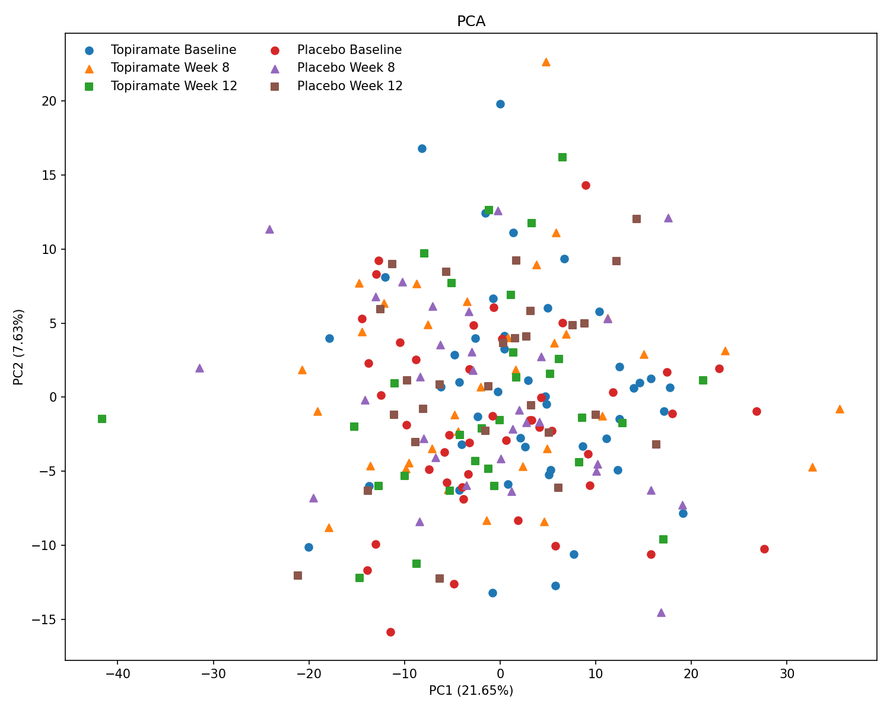
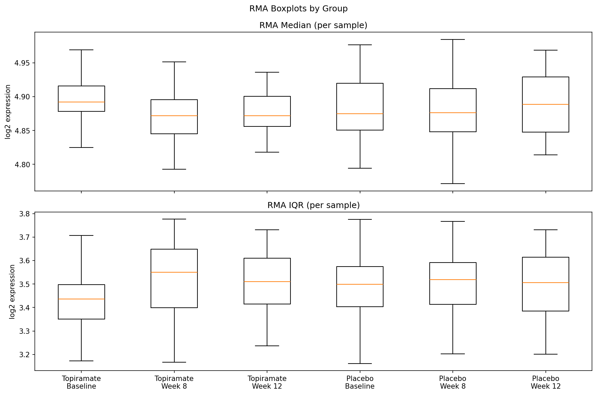
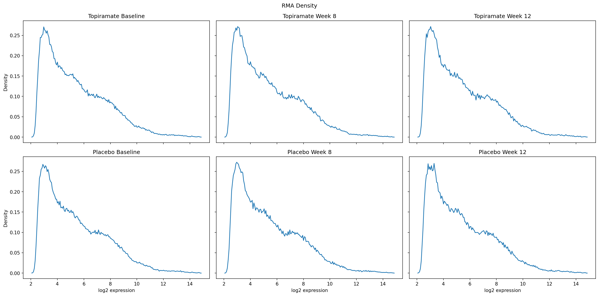

## Preambling

Preambling is mostly reading the series matrix and the raw CEL filenames, pulling out the sample metadata needed for the project, and writing a master sample sheet CSV for the downstream analysis steps.

We use the public GEO release for GSE107015: 

- `GSE107015_series_matrix.txt`: the GEO series matrix. Here we only use the `!Sample_*` metadata rows.
- `GSE107015_RAW/*.CEL.gz`: the raw Affymetrix Human Genome U-133 Plus 2.0 files. Filenames such as `GSM2859594_EA05064_31476_H133_Plus_10265_3.CEL.gz` carry the GEO sample id, batch code, scan id, platform code, subject id, and a timepoint code.

So, we have whole-blood samples from placebo and topiramate arms at baseline, week 8, and week 12. The main difference is that this step follows the **public** GEO submission, so it works from the released array files and sample annotations rather than the paper's full internal analysis set.

The master sample sheet is just a join between the CEL filenames and the series-matrix metadata. It keeps one row per array with subject id, treatment arm, timepoint, demographics, platform and batch fields, and the original filenames so downstream steps can work with the same trial layout as the study.

## Quality control

The quality-control step takes the public CEL files through two standard Affymetrix checks: MAS5 present calls for a simple chip-level detection summary, and RMA for background correction, normalization, and log-scale expression summarization. 

Across the public GEO release, this gives us 209 arrays from 98 subjects over 54,675 probe sets. That is close to, but not identical with, the 212 RNA samples described in the paper, which is expected here because this project is working from the public GEO submission rather than the paper's full internal analysis set.

| Metric | Value |
| --- | --- |
| Samples / subjects / probe sets | 209 / 98 / 54,675 |
| Topiramate / placebo | 107 / 102 |
| Baseline / week 8 / week 12 | 88 / 65 / 56 |
| MAS5 present % (min / median / max) | 34.41 / 44.19 / 50.68 |
| RMA median (min / median / max) | 4.753 / 4.880 / 5.005 |
| RMA IQR (min / median / max) | 2.968 / 3.494 / 3.794 |
| PCA variance explained (PC1 / PC2) | 21.65% / 7.63% |

- `n_samples`, `n_subjects`, and `n_probe_sets` describe the size of the dataset that actually made it through preprocessing.
- `n_topiramate`, `n_placebo`, `n_baseline`, `n_week8`, and `n_week12` describe the arm and timepoint balance that the next model will have to work with.
- `present_pct_*` summarizes the fraction of probe sets called present by MAS5 on each array. Lower values can flag weaker chips, but here most arrays sit in the same broad low-to-mid 40% range, so there is nothing alarming worth mentioning here. 
- `rma_median_*` summarizes the center of each normalized array. After successful RMA normalization, these values should line up fairly tightly, which they do here.
- `rma_iqr_*` summarizes the within-array spread of normalized expression. Similar IQRs across samples suggest that one group is not globally compressed or inflated relative to another.
- `pc1_variance_pct` and `pc2_variance_pct` I mean this is pretty self explanatory. 

### PCA after RMA

The PCA cloud is fairly mixed across treatment arms and timepoints. There is no clean split between topiramate and placebo, and there is no week-specific cluster that would suggest a dominant batch effect or a failed normalization step. A few samples sit on the edges of the cloud, especially `GSM2859594` and `GSM2859640`, so those are worth keeping in mind for sensitivity checks later, but they do not form a separate technical cluster.

### RMA boxplots

These boxplots show the per-sample median and IQR after RMA, grouped by arm and timepoint. The medians are tightly aligned across all six groups, and the IQR distributions are close enough that no single arm or timepoint looks globally shifted, compressed, or inflated. That is what we want to see before moving into any comparison of biological groups, because it suggests that large between-group differences are not being driven by trivial scale effects.

### RMA density

The group-level density curves have almost the same overall shape. There is no obvious bimodality, truncation, or group-specific intensity profile after normalization. In practice, this says the arrays are living on a shared expression scale and that the normalization step did its job.